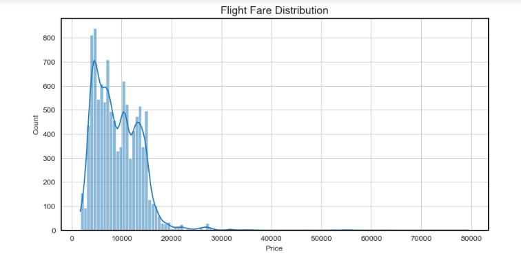
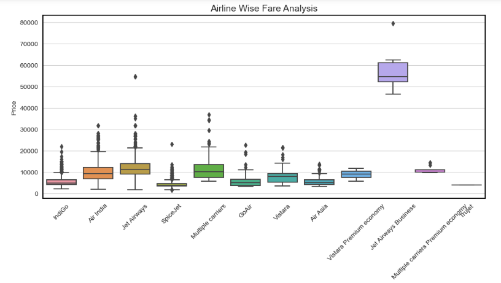
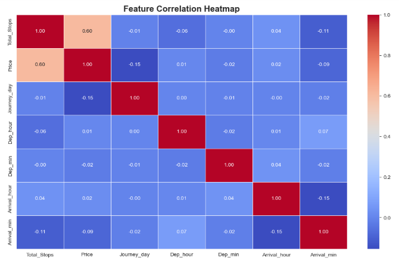
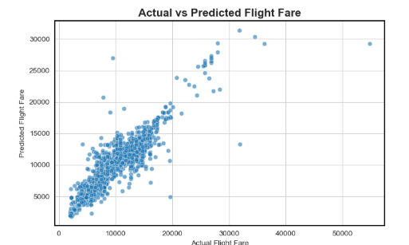
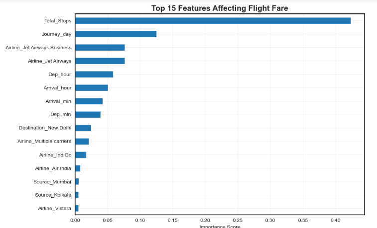

# ✈️ Flight Fare Prediction using Machine Learning

> **An End-to-End Machine Learning project that predicts flight ticket prices using historical airline booking data. The project demonstrates Data Cleaning, Feature Engineering, Exploratory Data Analysis (EDA), Machine Learning Model Development, Hyperparameter Tuning, and Performance Evaluation using Random Forest Regression.**

---

# 📌 Project Overview

Flight ticket prices vary based on multiple factors such as airline, route, duration, departure time, arrival time, and number of stops. This project develops a Machine Learning Regression model capable of accurately predicting flight fares using historical flight booking data.

The project follows the complete Data Science lifecycle, from data preprocessing to model evaluation.

---

# 🎯 Business Problem

Airfare prices fluctuate due to several operational and seasonal factors. Predicting ticket prices helps travelers make informed booking decisions and enables travel platforms to provide more accurate fare estimates.

---

# 📂 Dataset Information

The dataset contains flight booking details such as:

- Airline
- Date of Journey
- Source
- Destination
- Route
- Departure Time
- Arrival Time
- Duration
- Total Stops
- Additional Information
- Price (Target Variable)

---

# 🛠️ Technology Stack

### Programming Language

- Python

### Libraries

- Pandas
- NumPy
- Matplotlib
- Seaborn
- Scikit-learn

### Machine Learning

- Random Forest Regressor

### Hyperparameter Optimization

- RandomizedSearchCV

---

# 🚀 Project Workflow

### ✔ Data Collection

- Imported Training and Testing datasets.

### ✔ Data Cleaning

- Removed missing values
- Converted data types
- Removed unnecessary columns

### ✔ Feature Engineering

Created new features including:

- Journey Day
- Journey Month
- Departure Hour
- Departure Minute
- Arrival Hour
- Arrival Minute
- Duration Hours
- Duration Minutes

### ✔ Exploratory Data Analysis (EDA)

Performed detailed analysis to understand:

- Flight Fare Distribution
- Airline-wise Price Comparison
- Correlation between Features
- Important Features affecting Fare

### ✔ Data Preprocessing

- One Hot Encoding
- Label Encoding

### ✔ Model Development

Built a Machine Learning Regression model using **Random Forest Regressor**.

### ✔ Hyperparameter Tuning

Optimized model performance using **RandomizedSearchCV**.

---

# 📊 Exploratory Data Analysis

## Flight Fare Distribution

Understanding the distribution of flight ticket prices.



**Insights**

- Most ticket prices fall within the lower fare range.
- A small number of premium flights create a right-skewed distribution.
- Presence of outliers indicates premium airline pricing.

---

## Airline Price Analysis

Comparison of ticket prices across different airlines.



**Insights**

- Premium airlines generally charge higher fares.
- Budget airlines show comparatively lower average ticket prices.
- Airline selection has a significant impact on fare prediction.

---

## Correlation Heatmap

Correlation analysis between numerical features.



**Insights**

- Feature relationships were analyzed before model development.
- Correlation helps identify useful predictors for fare estimation.

---

# 📈 Model Performance

The model was evaluated using standard regression metrics.

### Evaluation Metrics

- Mean Absolute Error (MAE)
- Mean Squared Error (MSE)
- Root Mean Squared Error (RMSE)
- R² Score

---

## Actual vs Predicted Flight Fare

Comparison between actual and predicted ticket prices.



**Insights**

- Predicted values closely follow actual fare values.
- Random Forest achieved strong prediction accuracy.
- The model effectively captures pricing patterns from historical data.

---

## Feature Importance

Top features influencing flight ticket prices.



**Insights**

- Duration, Airline, Route, Total Stops, and Journey Date are among the most influential features.
- Feature importance improves model interpretability.

---

# ⭐ Key Features

- End-to-End Machine Learning Pipeline
- Data Cleaning & Preprocessing
- Feature Engineering
- Exploratory Data Analysis (EDA)
- Random Forest Regression
- Hyperparameter Tuning
- Model Evaluation
- Feature Importance Analysis
- Industry-Standard Project Structure

---

# 📁 Project Files

```
Flight-Fare-Prediction-ML
│
├── Data_Train.xlsx
├── Test_set.xlsx
├── Sample_submission.xlsx
├── Fare Distribution .png
├── Airline Price Analysis.png
├── Coorelaton Heatmap.png
├── Actual VS Predicted .png
├── Feature Importance .png
├── Flight_Fare_Prediction.ipynb
├── Flight_Fare_Prediction_Model.pkl
├── requirements.txt
└── README.md
```

---

# 🔮 Future Improvements

- Build an interactive Streamlit Web Application
- Deploy the model on AWS or Azure
- Integrate Real-Time Flight Fare API
- Compare performance with XGBoost and LightGBM
- Dockerize the application

---

# ⚙️ Installation

Clone the repository:

```bash
git clone https://github.com/YOUR_USERNAME/Flight-Fare-Prediction-ML.git
```

Navigate to the project directory:

```bash
cd Flight-Fare-Prediction-ML
```

Install required libraries:

```bash
pip install -r requirements.txt
```

Run the Jupyter Notebook:

```bash
jupyter notebook
```

---

# 👨‍💻 Author

## Chirag Kapoor

**Data Analyst | Python | SQL | Power BI | Machine Learning**

📧 Email: kapoorchirag902@gmail.com

⭐ If you found this project useful, consider giving it a Star.
